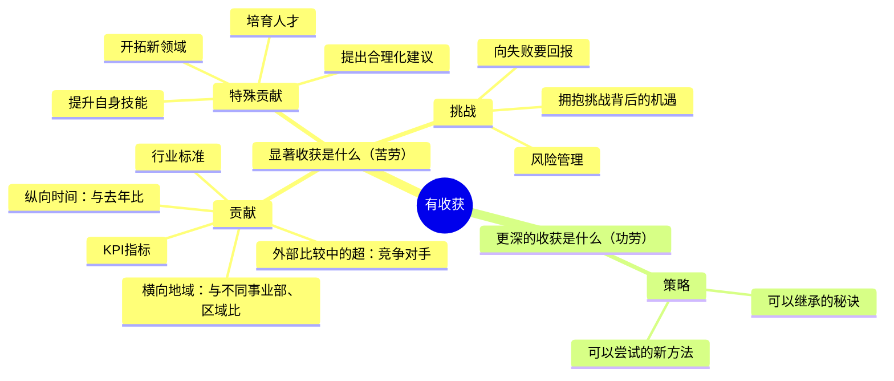
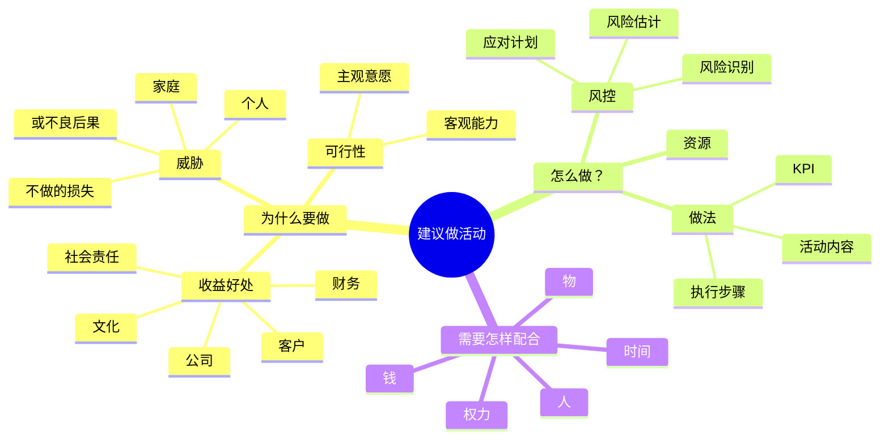
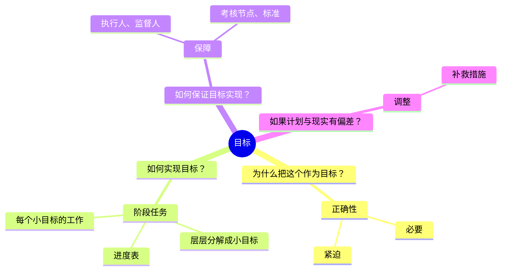
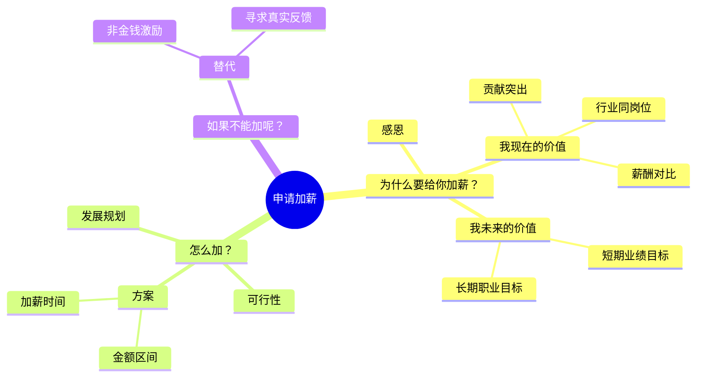
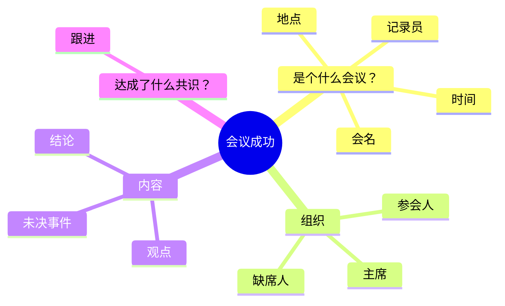
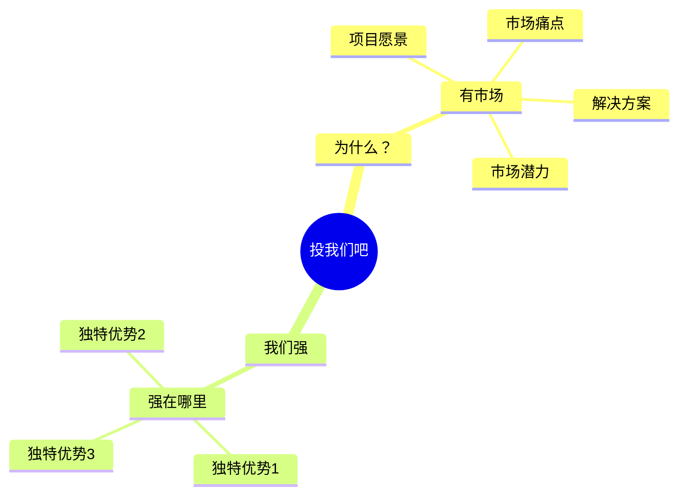

# 职场写作金字塔模板库

本文档包含课程中提供的常用文案金字塔结构模板，可直接参考使用。

## 年终总结-金字塔结构

**写作要点：**
- 基调：有深度（不是流水账，是行动指南）
- 塔尖不是回顾，而是行动指南
- 将工作成果写出意义，提供一线经验、不同视角
- 在罗列贡献后，找出问题或机遇，以及解决方案

## 活动方案-金字塔结构

**写作要点：**
- 阐述为什么要做（收益、威胁、可行性）
- 说明怎么做（做法、风控、KPI）
- 明确需要怎样配合（人、钱、物、时间、权力）

## 工作计划-金字塔结构

**写作要点：**
- 明确目标的正确性和紧迫性
- 将大目标层层分解为小目标
- 设定保障措施和考核标准
- 预留调整空间

## 加薪申请-金字塔结构

**写作要点：**
- 先表达感恩，再阐述价值
- 用数字证明贡献（信息化语言）
- 提出合理的加薪方案（金额区间、时间）
- 准备替代方案（非金钱激励）

## 会议记录-金字塔结构

**写作要点：**
- 清晰记录会议基本信息
- 明确达成的共识和结论
- 记录未决事件和后续跟进事项

## 项目计划书-金字塔结构

**写作要点：**
- 按照投资人逻辑组织内容
- 先讲行业和市场，再讲自己
- 融资额度放最后（先讲价值，再讲价格）

## 商业计划书完整结构

按照"要话先说"的读者逻辑，内容排序如下：

1. **项目愿景**：你要做一件什么样的大事（高度精炼的一句话）
2. **市场痛点**：这件事为什么值得做
3. **解决方案**：这把钥匙能开得了这把锁
4. **市场潜力**：市场规模、用户画像、竞品分析
5. **独特优势**：行业经验、核心技术、牛人团队
6. **发展规划**：盈利模式和发展路径
7. **财务分析**：需要多少钱

**注意：** 退出机制、利润分红等内容在初次接触中不重要，可不写。

## SCQA序言示例

### 示例1：团队沟通优化
- **S（情境）**：增强团队凝聚力至关重要，紧密团结的队伍和雇员的业绩表现密不可分。
- **C（冲突）**：然而，团队效能的关键不在于每次沟通后达成的结果，而在于沟通方式。沟通模式才是预测团队能否成功最重要的指标。
- **A（回答）**：我建议在本公司设置周五午餐会，来建立团队成员间的信任，提高他们加入团队谈话的参与度。

### 示例2：跨文化沟通培训
- **A（答案）**：我建议在团队赴日本谈判以前，进行一次跨文化沟通的内训。
- **S（情境）**：这次跨国谈判涉及到中方、日方和美方，因为文化不同，不存在单一的国家攻略。
- **C（冲突）**：而我们团队的同事，对于怎样恰当表达异议，怎样收放自如，怎样和其他文化人群建立信任，都不曾了解过。

### 示例3：人才甄选标准
- **C（冲突）**：去年我公司评出的十佳员工，出乎意料的都是经验小于五年的行业新手。
- **S（情境）**：当今市场迅速变化，我们面临的挑战也不断迭代，这意味着人力资源部在挑选人才的标准也需要与时俱进。
- **Q（问题）**：我们怎样去甄选高潜力复合型人才呢？
- **A（回答）**：我建议从三方面树立甄选标准：正确的动机、好奇心、洞见。
